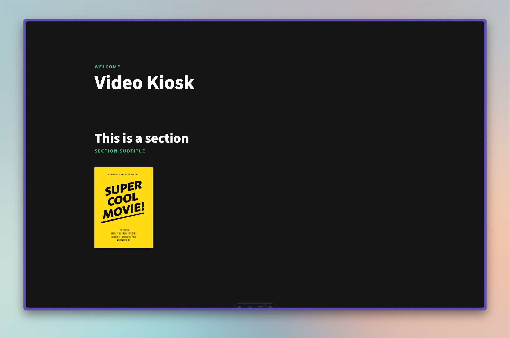

# Video Kiosk

This is a very simple web-based videoplayer. It provides a netflix-like interface where users can select between different films based on their covers and watch them in a fullscreen player.

As it was designed for a exhibition, it is as simple as possible. Just click on a movie poster, watch it, go back again, and pick another one. Don’t forget the popcorn!



## How does it work?

The system is based on [Astro](https://astro.build/) and can be easily filled with your content, built and run wherever you want. Apart from the videos itself and their corresponding posters you can provide additional data like the title and authors of each film.

The player itself is based on [video.js](https://videojs.com/)

## Features

- Main menu to select films based on their posters
- Automatic fullscreen player
- Overlay for player, showing additional information for each film
- Autoplay
- Structure films into different collections
- Customizable text for UI elements

## How to use:

Please note that this is a personal project made public. You are free to use it and modify it however you like, but as it was developed for a special use case, it is very likely you need to adapt quite a few things to your needs.

To set up and use the player, you need to fill it with your movie data and run a few simple terminal commands. This guide should explain everything in detail, even if you are not familiar with the workflow:

### 1. Clone or download this repository

### 2. Install dependencies

Make sure you have _node.js_ and _npm_ installed on your machine (You can do that [here](https://nodejs.org/en/download)). Then run in your terminal:

```console
$ npm i
```

### 3. Provide your data

You can provide your films and posters by simply dropping them in the `public` folder.
The ideal resolution for the posters is 707px × 1000px and they should be in `.webp` format.
For best browser support the films should be in `.mp4` format.

You also need to create a corresponding markdown file for each movie in the `src/content/films` directory.
Make sure to give them all matching file names and your films should now show up in the interface.

In the end the file structure should look something like this:

```text
/
├── public/
│   ├── films/
│   │   ├── super-cool-movie.mp4
│   │   └── …
│   └── posters/
│       ├── super-cool-movie.webp
│       └── …
├── src/
│   ├── content/
│   │   ├── films/
│   │   │   ├── super-cool-movie.md
│   │   │   └── …
│   │   …
│   …
…
```

### 4. Add additional information

You can provide additional Information for each film in the frontmatter of their markdown files. Currently the properties `title` and `author` are supported.

**src/content/films/super-cool-movie.md:**

```markdown
---
title: Super Cool Movie
author: Quentin Tarantino
---
```

### 5. Structure your content

The films can be grouped into different sections by creating a markdown file for each section in the `content/sections` directory. You then need to provide an `id` for each section and give all the films, that belong in a section the same `sectionID`:

**src/content/sections/example-section.md:**

```markdown
---
title: This is a section
subtitle: Section Subtitle
id: example-section
---
```

**src/content/films/super-cool-movie.md:**

```markdown
---
title: Super Cool Movie
author: Quentin Tarantino
sectionID: example-section
---
```

### 6. Customize player (optional)

You can customize UI labels and the main title on the top of the UI by changing the properties of the files in the `content/ui` directory.

#### Styling

If you want to change the general looks you can check out `src/styles/global.css` and change stuff like the accent color or typeface.

### 7. Run dev server to test

To check if everything is working properly just start the dev server at any time:

```console
$ npm run dev
```

### 6. Build

```console
$ npm run build
```

Builds your player into the `dist` directory.

### 7. Run

You can now run the contents of your `dist` directory on any server or just start a local webserver on your target machine, which was the most handy solution for me as I only needed to run it on a few machines for an exhibition.

---

#### Local http server with Python (example)

For Mac, Python is a good option for the local server as it comes preinstalled or can easily be installed with XCode Command Line Tools. Just navigate to the folder with the built project and run the following (You’ll be prompted if you need to install something):

```
$ python3 -m http.server
```

Type `localhost:8000` in your browsers adress bar and enjoy!

## Notes

Most browsers have an option to hide their UI and show nothing but the web page in full screen, which is handy if you want a fully focused experience without any distracting elements.

Autoplay does not work by default in Safari. It needs to be enabled under “Settings > Websites”

While running on a local Python server I ran into some issues with scrubbing through the video timeline in Chrome. This seems to be fixed in the latest version.
